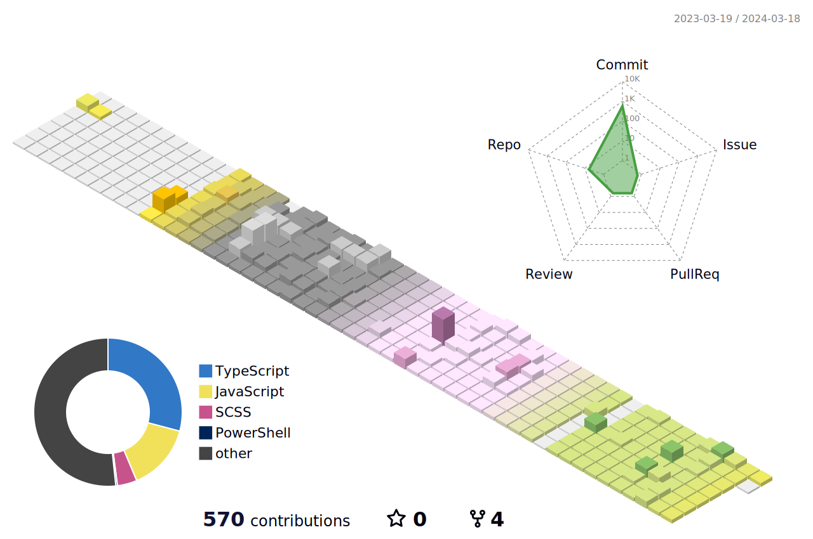

</image>

  
  ## 프론트엔드 개발자 **안윤희**입니다. 😀
  ### 렙업중.. 🌳

- ✒ 기획과 트랜드에 관심 있는 개발자
- ✏ 현재는 프론트엔드 개발 위주로 공부중
- 🔑 코딩을 목적이 아닌 수단이라고 생각합니다.
- 🎨 의미있는 / 다른 사람에 도움이 되는 서비스를 만드는 것이 목표

## 블로그

## Tech Stack 🛠
  
   
  
  
  
   
  
  
  
  

## My Stats! 🍭

